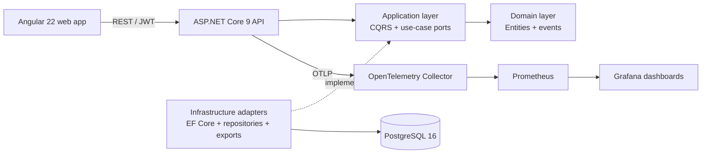

# Lemon Writer

**A cozy, private writing studio for building books, worlds, and better drafts.**

Lemon Writer brings manuscript editing, visual story planning, version history, and publication-ready exports into one calm workspace. It is designed for writers who want structure without turning their creative process into project management.

> **We measure your story, not your behavior.** Story-health metrics are optional and disabled by default.

## Why Lemon

Most writing tools focus on either prose or planning. Lemon connects both:

- Write and organize books, series, chapters, and alternate drafts.
- Preserve chapter history with snapshots, comparisons, and restoration.
- Build characters, relationships, places, objects, lore, magic systems, and research notes.
- Arrange story events on a visual, draggable timeline.
- Set writing goals and track progress without behavioral surveillance.
- Review opt-in structural health checks for incomplete or disconnected story elements.
- Export books as PDF or EPUB, including cover artwork.
- Personalize the workspace with Cozy Amber, Cozy Forest, Cozy Night, or a custom theme.

Cozy Amber is Lemon's flagship visual identity: warm, editorial, and intentionally distinct from generic productivity software.

## Product capabilities

### Writing and revision

- Focused chapter editor
- Draft branches and draft publishing
- Version snapshots and visual timeline
- Side-by-side version comparison
- Restore or recover earlier content
- PDF and EPUB export
- Base64 cover storage (an intentional interim implementation before object storage)

### Story Studio

- Characters, motivations, attributes, and plot involvement
- Visual relationship mapping
- Places and scenarios
- Objects and artifacts
- Draggable story chronology with structured event details
- Lore and glossary
- Magic-system rules
- Notes and research
- Gallery and media references
- Writing goals with targets, deadlines, and progress
- Opt-in story-health metrics and novel linting

Timeline events can reference existing characters, objects, and scenarios. Story-health checks currently cover structural completeness, character and relationship coverage, timeline completeness, orphan characters, empty locations, and unused objects.

### Identity and personalization

- Email/password authentication
- Google OAuth authentication
- JWT-protected application routes
- Three contrast-aware built-in themes
- Custom theme generation
- Profile settings and account menu

## Architecture

Lemon is a modular monolith with clean architectural boundaries and service-ready infrastructure. It uses REST for the browser-facing API and includes gRPC contracts for service-to-service evolution. The current deployment is intentionally simpler than a distributed microservice topology while keeping domain, application, infrastructure, and transport concerns separate.



Browser-facing controllers depend only on Application contracts. Database queries, privacy persistence,
Story Studio operations, exports, and resource authorization are implemented by Infrastructure adapters
and wired exclusively in the API composition root. This keeps EF Core out of transport code and allows
each capability to move behind a separate process boundary later without rewriting its HTTP contract.

Story Studio is divided into independently registered capability slices:

- Entries and worldbuilding: characters, places, objects, lore, magic, research, gallery, and goals
- Timeline: chronological ordering and reorder validation
- Relationships: character graph edges and cross-book integrity checks
- Story metrics: privacy-aware structural analysis calculated only after user opt-in

### Repository layout

```text
Lemon/
├── BackEnd/
│   ├── src/
│   │   ├── LemonWriter.Domain/          Domain entities, events, and contracts
│   │   ├── LemonWriter.Application/     CQRS use cases, validation, and DTOs
│   │   ├── LemonWriter.Infrastructure/  EF Core, migrations, repositories, gRPC, exports
│   │   └── LemonWriter.API/             REST API, auth, health, and telemetry
│   ├── tests/                            Backend automated tests
│   └── proto/                            gRPC contracts
├── FrontEnd/lemon-writer/
│   └── src/app/
│       ├── core/                         Auth, guards, interceptors, models, API services
│       ├── features/                     Route-level product capabilities
│       └── shared/                       Reusable navigation and UI components
└── scripts/
    ├── docker-compose.yaml               Local application and observability stack
    ├── postgres/                         Idempotent development seed scripts
    └── observability/                    OTel, Prometheus, and Grafana provisioning
```

### Technology

| Area | Technology |
|---|---|
| Frontend | Angular 22, TypeScript 6, standalone components, Angular Material/CDK, RxJS |
| Backend | .NET 9, ASP.NET Core, MediatR, FluentValidation, Serilog |
| Data | PostgreSQL 16, Entity Framework Core, code-first migrations |
| Authentication | JWT bearer tokens, BCrypt password hashing, Google OAuth 2.0 |
| Documents | QuestPDF and EPUB package generation |
| Observability | OpenTelemetry, Prometheus, Grafana, structured logs |
| Tooling | Docker Compose, ESLint, Angular tests, .NET tests, Compose Watch |

## Quick start with Docker

### Requirements

- Docker Desktop with Docker Compose v2
- At least 4 GB of memory available to Docker
- Ports `3000`, `4200`, `4317`, `4318`, `5432`, `8080`, and `9090` available

From the repository root:

```bash
docker compose -f scripts/docker-compose.yaml up -d --build
```

Open:

| Service | URL |
|---|---|
| Lemon Writer | http://localhost:4200 |
| Backend API | http://localhost:8080 |
| Grafana | http://localhost:3000 |
| Prometheus | http://localhost:9090 |

The development stack creates a local administrator account:

```text
Email:    admin@admin.com
Password: admin123
```

These credentials are strictly for local development. Never reuse or expose them in a public or production environment.

Stop the stack without deleting persisted data:

```bash
docker compose -f scripts/docker-compose.yaml down
```

Delete the local databases and observability volumes as well:

```bash
docker compose -f scripts/docker-compose.yaml down --volumes
```

### Live development with Compose Watch

```bash
docker compose -f scripts/docker-compose.yaml watch
```

Changes under the frontend or backend source directories trigger image rebuilds according to the Compose watch configuration.

## Configuration

Create a `.env` file beside your shell working directory or export the following variables before starting Compose:

```dotenv
JWT_KEY=replace-with-a-long-random-secret
GOOGLE_CLIENT_ID=your-google-client-id
GOOGLE_CLIENT_SECRET=your-google-client-secret
GRAFANA_USER=admin
GRAFANA_PASSWORD=replace-this-password
```

The defaults in `scripts/docker-compose.yaml` are development conveniences, not production-safe configuration.

For Google authentication, configure the OAuth client with the backend callback used by the application and ensure the frontend base URL and allowed CORS origins match the deployed environment.

## Running without Docker

### Backend

Requirements: .NET SDK `9.0.308` or a compatible later patch, plus PostgreSQL 16.

```bash
cd BackEnd
dotnet restore
dotnet run --project src/LemonWriter.API
```

Provide a valid `ConnectionStrings:DefaultConnection`, JWT secret, and OAuth configuration through user secrets, environment variables, or a non-committed development settings file.

### Frontend

Requirements: Node.js `24.15.0` or later supported by Angular 22.

```bash
cd FrontEnd/lemon-writer
npm ci
npm start
```

The development environment file must point `apiUrl` to the running API. Production builds use `src/environments/environment.prod.ts` through Angular file replacement.

## Quality checks

Frontend:

```bash
cd FrontEnd/lemon-writer
npm run lint
npm test -- --watch=false --browsers=ChromeHeadless
npm run build
```

Backend:

```bash
cd BackEnd
dotnet test
dotnet build LemonWriter.sln
```

Full frontend verification is available through:

```bash
npm run check
```

## Database and migrations

The API applies pending Entity Framework migrations during startup. PostgreSQL data is stored in the `lemon_pgdata` Docker volume.

Create a migration from `BackEnd` after changing the EF model:

```bash
dotnet ef migrations add MeaningfulMigrationName \
  --project src/LemonWriter.Infrastructure \
  --startup-project src/LemonWriter.API
```

Review generated migrations before applying them. Back up production data before schema changes.

## Health and observability

The Docker stack includes:

- Application health endpoints and container health checks
- OpenTelemetry traces and metrics exported through OTLP
- Prometheus metric collection
- Provisioned Grafana data sources and Lemon dashboards
- Structured Serilog request logs

Observability configuration is versioned under `scripts/observability`. Telemetry should never include passwords, access tokens, manuscript bodies, cover image data, or OAuth secrets.

## Privacy and data use

Lemon's product principle is: **measure the story, not the writer.**

Story-health metrics are opt-in and disabled by default. When enabled, Lemon evaluates structural information such as counts, coverage, relationships, and incomplete entries.

Lemon does not intentionally collect by default:

- Individual keystrokes
- Typing speed or behavioral writing patterns
- Reading habits
- Manuscript content for AI model training

The local application stores account details, password hashes, manuscripts, story-planning records, cover images, and media required to provide the product. Cover images are currently stored as Base64 database values and should be migrated to private object storage before operating at production scale.

Repository documentation is not, by itself, a complete privacy policy or data-processing agreement. Any public deployment must publish jurisdiction-appropriate privacy notices, retention rules, subprocessors, lawful bases, account deletion procedures, and data-subject request channels.

## Security and production readiness

Before exposing Lemon outside a trusted development environment:

1. Replace all default passwords and JWT secrets.
2. Store secrets in a managed secret provider; never commit them.
3. Require HTTPS and configure trusted proxy headers correctly.
4. Restrict CORS to the real frontend origin.
5. Configure Google OAuth with exact production redirect URIs.
6. Persist and protect ASP.NET Core data-protection keys.
7. Use private database networking, encrypted backups, and least-privilege credentials.
8. Add rate limiting, account recovery, email verification, and abuse controls.
9. Review dependency and container-image vulnerabilities continuously.
10. Define retention, deletion, incident-response, and disaster-recovery procedures.

Do not report sensitive security issues through a public issue. Until a dedicated security contact is published, contact the repository owner privately.

## Contributing

Before opening a change:

1. Create a focused branch.
2. Keep domain rules out of controllers and UI components.
3. Add or update tests for changed behavior.
4. Run the relevant quality checks.
5. Include database migrations for persisted model changes.
6. Document new environment variables, ports, and operational dependencies.
7. Avoid committing secrets, generated build output, local databases, or personal manuscript data.

Use clear commit messages and keep pull requests small enough to review safely. Significant architectural or product changes should be discussed with the maintainers before implementation.

## Legal and license status

Copyright © the Lemon Writer project owner(s). All rights reserved.

This repository currently does **not** contain an open-source license. Unless and until a license file is added, no permission is granted to copy, modify, distribute, sublicense, sell, or commercially use the source code beyond rights provided by applicable law or explicit written authorization from the copyright holder.

Third-party packages, fonts, container images, and services remain subject to their own licenses and terms. Product names and trademarks belong to their respective owners. Google authentication requires compliance with Google's applicable API and branding policies. Grafana, Prometheus, OpenTelemetry, Angular, .NET, PostgreSQL, and other named technologies do not sponsor or endorse Lemon Writer.

This software is under active development and is provided without a production warranty. Nothing in this README constitutes legal advice. Before commercial release, adopt an explicit software license, terms of service, privacy policy, cookie policy where applicable, acceptable-use policy, and accessibility statement reviewed for the jurisdictions in which the service operates.

---

**Lemon Writer — make space for the story only you can write.**
